# Hi, I'm Muhammad Yafizham 👋
### AI & Full-Stack Software Engineer | Enterprise Systems & LLM Workflows

I am a Software Engineer at PT Catur Sukses Internasional with a proven track record of single-handedly architecting, deploying, and operating **14+ enterprise production systems** across logistics, AI agent workflows, sales routing, and backend automation. Fluent in English (**IELTS Band 7**), I specialize in building production AI/LLM pipelines, high-concurrency backend services, real-time logistics engines, and enterprise ERP integrations.

[📄 Download My Resume (PDF)](https://github.com/Ham144/Ham144/raw/main/Resume_Muhammad_Yafizham_Batubara.pdf) | [💼 LinkedIn](https://www.linkedin.com/in/muhammad-yafizham-batubara/)

---

### 📈 GitHub Stats

  
  

---

### 🛠️ Core Technology Stack

| Focus Area | Technologies |
| :--- | :--- |
| **AI & LLM Workflows** | OpenRouter, OpenAI APIs, LangChain, LangGraph, Spaced Repetition Algorithms, Telegram Bot Webhooks |
| **Backend & APIs** | NestJS, Express.js, Node.js, FastAPI, RESTful APIs, WebSockets, SOAP/NTLM |
| **Databases & Caching** | PostgreSQL, MongoDB, Redis, SQLite/LibSQL, Prisma ORM, Mongoose, Pgvector |
| **Frontend & Mobile** | React, Next.js, React Native, Expo, React Flow, Tailwind CSS, Zustand |
| **Infrastructure & DevOps** | Docker, Linux VPS, Nginx, CI/CD (GitHub Actions), LDAP/Active Directory |
| **Integrations** | MS Dynamics NAV (ERP), Midtrans Payment Gateway, Cloudflare R2, Telegram Bot API, WhatsApp Web API |

---

> 🔒 **Proprietary Commercial IP & Source Code Notice:**
> The source code for the flagship platforms featured below represents proprietary commercial IP owned and architected by Muhammad Yafizham (Founder & Principal Systems Architect). All source repositories are strictly **Private** to protect custom engines, business logic, and commercial licensing rights.
> 
> Full architectural specifications, system design diagrams, UI screenshot galleries, and **Live Production Web Applications** are available below for evaluation. Private code audits or temporary read-only repository access can be arranged for technical hiring evaluations under mutual non-disclosure agreements (NDA).

---

## Featured Production Projects

---

### 1. 🔄 Approval Workflow Engine (Approva.ai)

> Dynamic multi-tenant approval system with a visual drag-and-drop workflow designer  
> 🔗 **Live Web Application:** [approva-ai.hexadim.com](https://approva-ai.hexadim.com)  
> 📊 **Scale & Impact:** Adopted across 5+ corporate departments, automating 800+ multi-tier approval workflows monthly.

Replaces hardcoded business approval paths with a visual graph editor. Administrators configure conditional routing (e.g., auto-escalate when purchase value exceeds threshold) with digital signatures and multi-channel alert dispatches.

  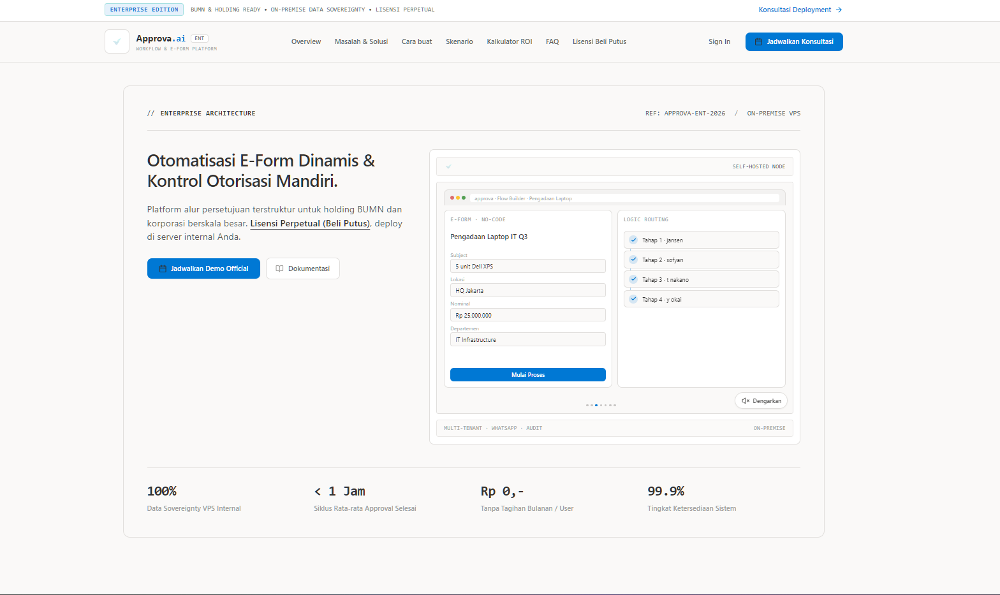

  
  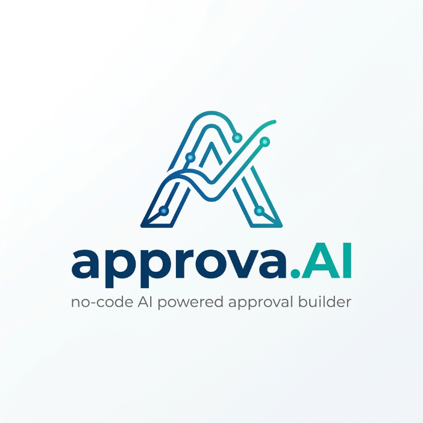

**Key capabilities:**
* **Visual Workflow Designer:** Drag-and-drop graph nodes (React Flow V11) to build multi-tier approval chains — no code changes, no redeployment.
* **Conditional Routing Engine:** Evaluates submitter roles, transaction values, and department rules to dynamically route each approval request.
* **Corporate SSO:** Authenticates via local Active Directory (LDAP) for unified enterprise identity management.
* **Multi-Channel Notifications:** Dispatches real-time alerts through Telegram Bot API and SMTP email upon each approval stage transition.
* **Digital Signatures & Audit Trail:** Every approval step is cryptographically signed and logged for compliance.

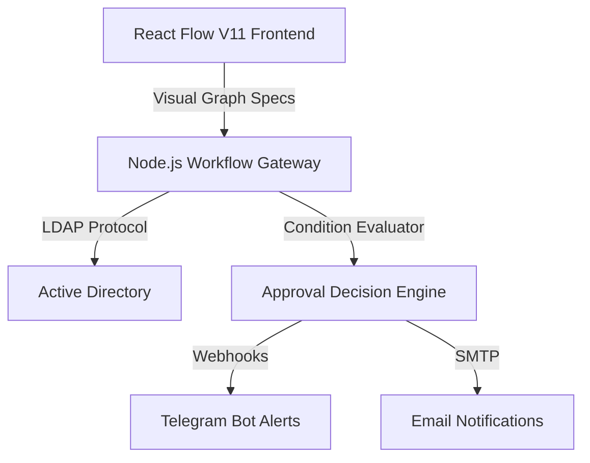
```mermaid
graph TD
    User[React Flow V11 Frontend] -->|Visual Graph Specs| API[Node.js Workflow Gateway]
    API -->|LDAP Protocol| AD[Active Directory]
    API -->|Condition Evaluator| Engine[Approval Decision Engine]
    Engine -->|Webhooks| Telegram[Telegram Bot Alerts]
    Engine -->|SMTP| Mail[Email Notifications]
```

---

### 2. 🧠 Spaced Retention Bot & Cognitive AI Engine

> AI-powered cognitive manager, spaced repetition scheduler, and knowledge conflict guard  
> 🔗 **Live Web Application:** [retention.pethalvoid.com](https://retention.pethalvoid.com)  
> 📊 **Scale & Impact:** Automates personal strategy retention, parses unstructured research notes with AI, and enforces decision consistency via automated Telegram dispatchers.

An intelligent knowledge management engine built to control cognitive capacity, eliminate decision fatigue, and enforce long-term memory retention using spaced repetition algorithms combined with LLM-powered note parsing.

**Key capabilities:**
* **AI Note Slicing & Auto-Categorization:** Automatically processes raw research notes or strategic logs, structuring them into core principles and mapping them to domain threads using OpenRouter LLMs.
* **AI Conflict Guard:** Prevents duplicate or contradictory strategic rules by performing side-by-side AI evaluation against historical database entries before persisting.
* **Spaced Repetition Engine (SuperMemo / Ebbinghaus Curve):** Computes optimal review intervals and dispatches automated reminder sessions via Telegram Webhook APIs.
* **Interactive Telegram Bot Interface:** Full remote control via `/focus` (RAM slot management), `/load` (10-second contextual cheatsheets), `/review` (inline mastery checks), and `/tanya` (AI business strategy consult).
* **Vercel Cron Integration:** Automated daily trigger pipeline executing spaced review dispatches with authorization header validation.

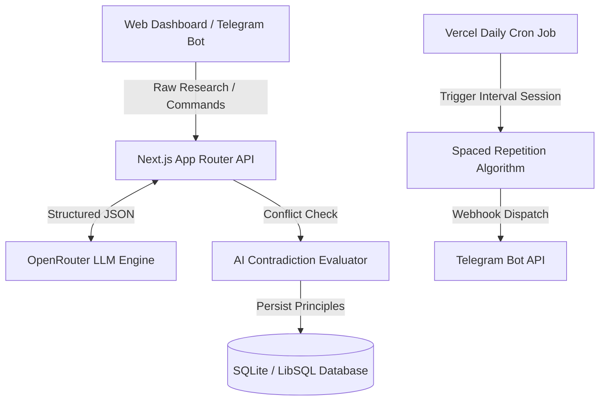
```mermaid
graph TD
    User[Web Dashboard / Telegram Bot] -->|Raw Research / Commands| Gateway[Next.js App Router API]
    Gateway <-->|Structured JSON| OpenRouter[OpenRouter LLM Engine]
    Gateway -->|Conflict Check| ConflictGuard[AI Contradiction Evaluator]
    ConflictGuard -->|Persist Principles| DB[(SQLite / LibSQL Database)]
    Cron[Vercel Daily Cron Job] -->|Trigger Interval Session| SpacedEngine[Spaced Repetition Algorithm]
    SpacedEngine -->|Webhook Dispatch| Telegram[Telegram Bot API]
```

---

### 3. 🗓️ Warehouse Queue Management System (WQMS)

> Real-time loading dock booking and Gantt board carrier scheduler  
> 🔗 **Live Web Application:** [orbit.pethalvoid.com](https://orbit.pethalvoid.com)  
> 📊 **Scale & Impact:** Serves 12+ enterprise warehouse facilities, managing ~2,500+ monthly dock bookings with zero booking collisions.

A multi-tenant enterprise platform that optimizes warehouse loading/unloading dock schedules, manages carrier queues, and eliminates truck congestion through automated time-slot allocation.

  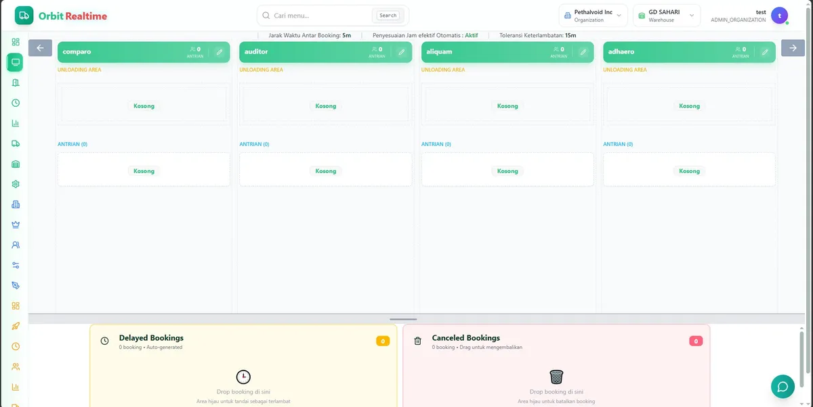

| Busy Time Management | Auto Time Picker |
| :---: | :---: |
| 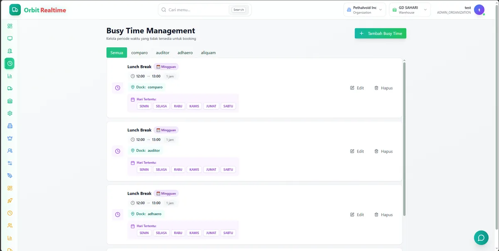 | 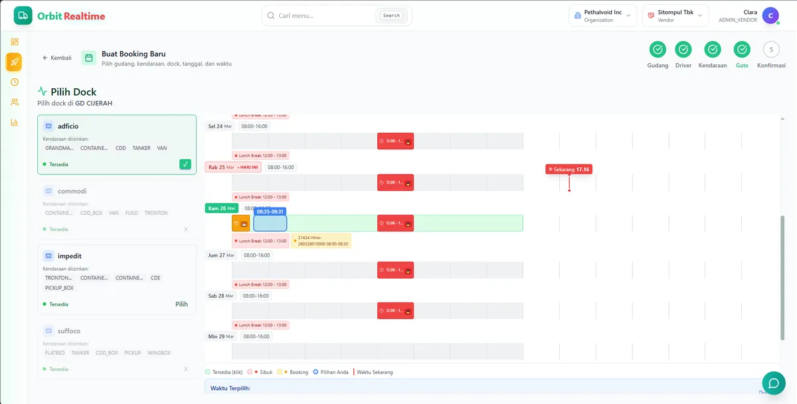 |

| Multi-Tenancy Support | Multiple Warehouse Rules |
| :---: | :---: |
| 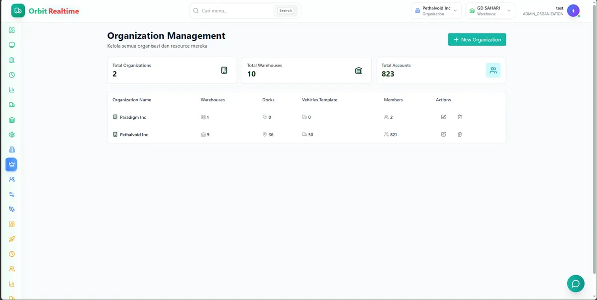 | 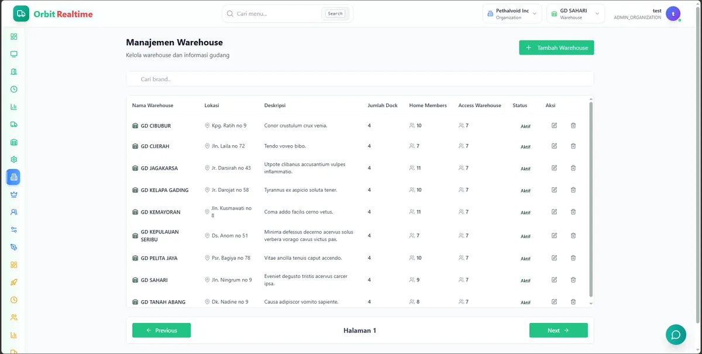 |

| Driver & Duration Setup | Booking Approvals & History |
| :---: | :---: |
| 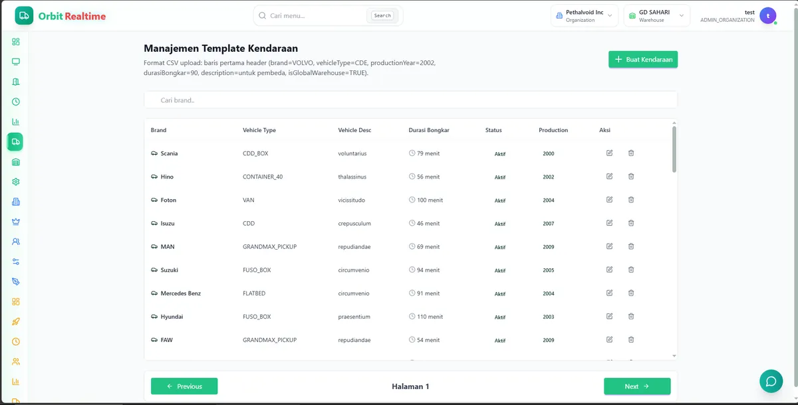 | 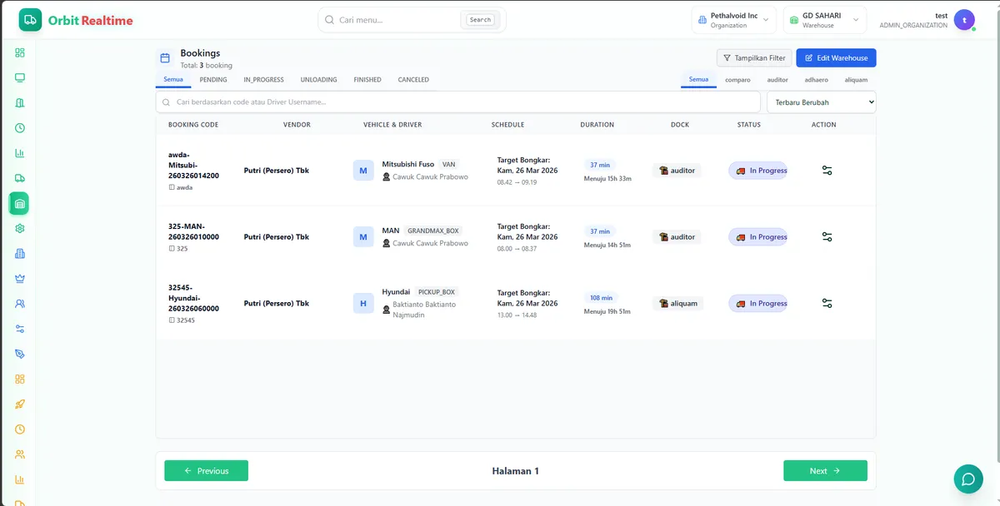 |

| Real-time Messenger | Organization Members |
| :---: | :---: |
| 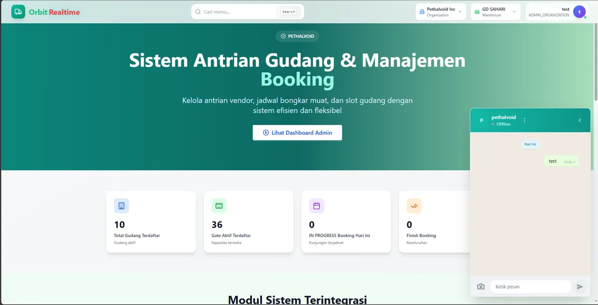 | 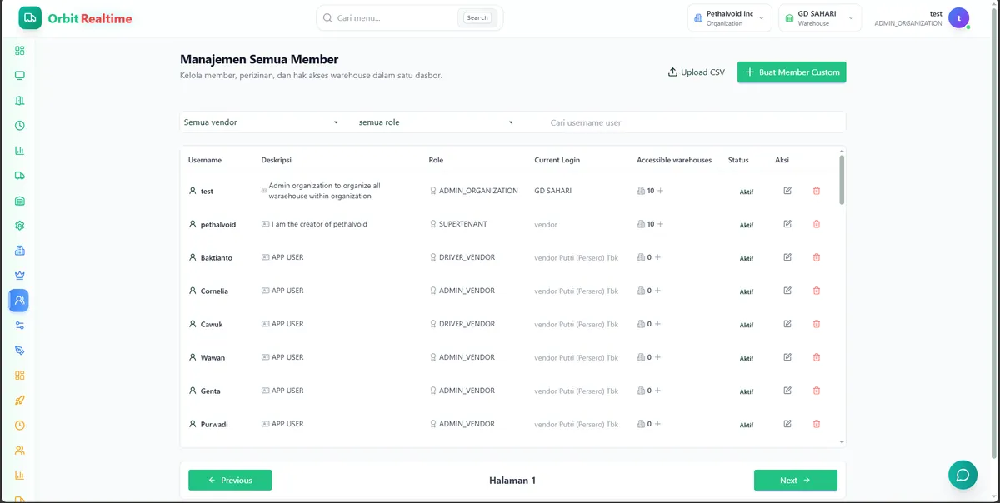 |

**Key capabilities:**
* **Dock Allocation Algorithm:** Prevents double-booking using Redis distributed cache locks and automatic collision resolution.
* **Live Gantt Board:** Warehouse guards and dock managers see real-time drag-and-drop queue boards via WebSocket updates.
* **Pre-Booking Portal:** Vendors and drivers reserve specific arrival time slots, reducing unscheduled congestion.
* **Real-time Messenger:** Persistent, authenticated chat rooms between drivers and warehouse dispatchers.
* **Active Directory SSO:** Unique LDAP configuration per tenant organization.
* **E2E Testing:** Full Playwright test suite for critical booking workflows.

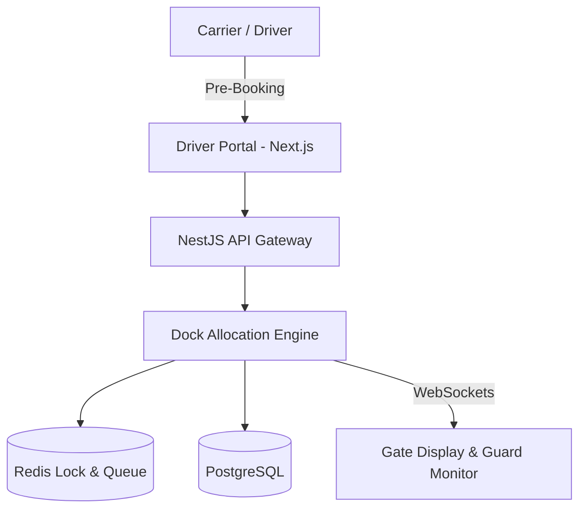
```mermaid
graph TD
    Carrier[Carrier / Driver] -->|Pre-Booking| Portal[Driver Portal - Next.js]
    Portal --> Gateway[NestJS API Gateway]
    Gateway --> QueueEngine[Dock Allocation Engine]
    QueueEngine --> RedisCache[(Redis Lock & Queue)]
    QueueEngine --> DB[(PostgreSQL)]
    QueueEngine -->|WebSockets| Display[Gate Display & Guard Monitor]
```

---

### 4. 🗺️ Field Sales CRM (S-BIT)

> Location-verified sales routing and client order-taking CRM with ERP integration  
> 🔗 **Live Web Application:** [sfa.pethalvoid.com](https://sfa.pethalvoid.com)  
> 📊 **Scale & Impact:** Tracks 50+ active field sales reps, auditing ~3,000+ geofenced client visits monthly with direct MS Dynamics NAV ERP synchronization.

An enterprise-grade Field Sales CRM for route planning, real-time GPS visit tracking, automated WhatsApp notifications, and deep Microsoft Dynamics NAV ERP integration.

  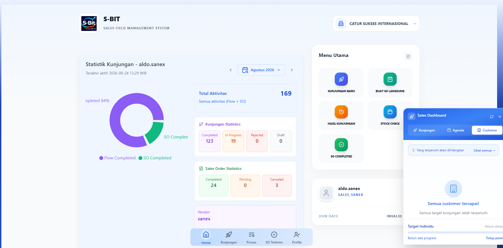

**Key capabilities:**
* **GPS Geofence Auditing:** Records real-time GPS coordinates during sales visits (Leaflet maps), eliminating fake check-ins.
* **Dynamics NAV ERP Sync:** Hourly SOAP/NTLM cron jobs synchronize customer registers, credit limits, sales targets, and push field-generated orders back to ERP.
* **Automated WhatsApp Dispatcher:** Sends order confirmations and visit receipts directly to customer WhatsApp contacts via `whatsapp-web.js`.
* **Dynamic Audit Forms:** Admins modify required visit questions (photo uploads, stock counts) without redeploying code.
* **Sales Analytics:** Recharts-powered dashboards for target tracking and performance reporting.

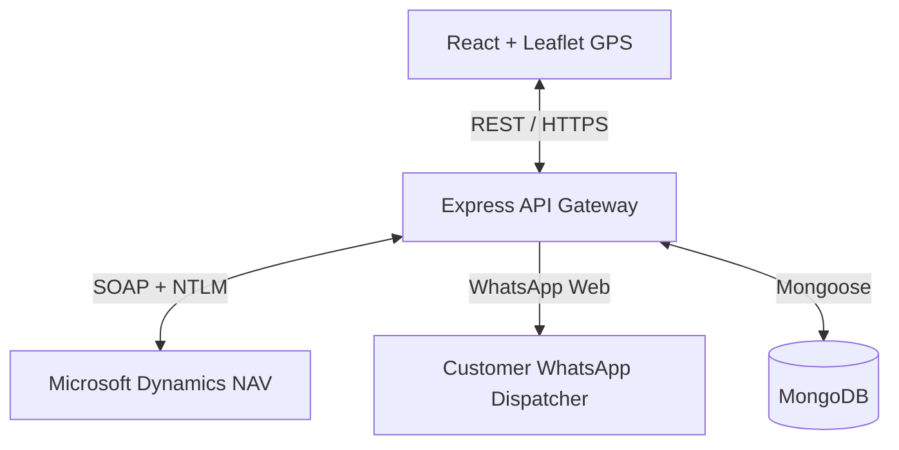
```mermaid
graph TD
    Client[React + Leaflet GPS] <-->|REST / HTTPS| Backend[Express API Gateway]
    Backend <-->|SOAP + NTLM| ERP[Microsoft Dynamics NAV]
    Backend -->|WhatsApp Web| WA[Customer WhatsApp Dispatcher]
    Backend <-->|Mongoose| DB[(MongoDB)]
```

---

### 5. 📱 Super POS Mobile

> Offline-first mobile Point of Sale with direct thermal printing and payment gateway  
> 🔗 **Live Web Application:** [pos.pethalvoid.com](https://pos.pethalvoid.com)  
> 📊 **Scale & Impact:** Deployed across 40+ retail outlets & sales reps, processing ~15,000+ monthly transactions with zero transaction loss.

A high-performance mobile POS application for sales representatives and retail outlet clerks, featuring offline transaction queueing, direct WiFi thermal printing, and cashless payment integration.

  

| Tablet Settlement | Invoice Management |
| :---: | :---: |
|  |  |

| Pending Invoice | Product Library |
| :---: | :---: |
|  |  |

| Promotions & Vouchers | Sales Analytics |
| :---: | :---: |
|  |  |

| Purchase Orders | Accounts Management |
| :---: | :---: |
|  |  |

| Customer Database | Crash Stack Traces |
| :---: | :---: |
| 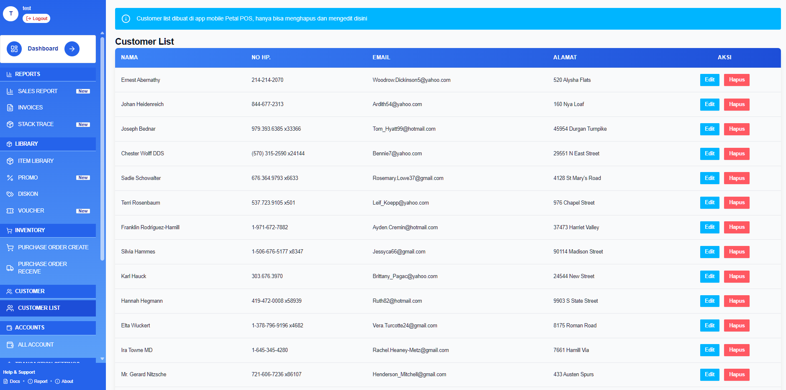 |  |

**Key capabilities:**
* **Offline-First Sync Engine:** Transactions complete fully offline in `AsyncStorage`, then auto-reconcile with the central MongoDB server once connectivity returns.
* **Direct ESC/POS Thermal Printing:** Generates raw ESC/POS command buffers and streams them over TCP sockets to network/WiFi thermal printers — no drivers or spoolers needed.
* **Midtrans Payment Gateway:** Generates dynamic QRIS codes and payment links in-app with automated webhook settlement listeners.
* **Promo & Discount Engine:** Evaluates multi-tier vouchers, item bundles, and outlet-specific discounts locally on-device.
* **Dynamic API Configuration:** Field agents configure and test custom backend URLs per subnet via an admin settings modal.

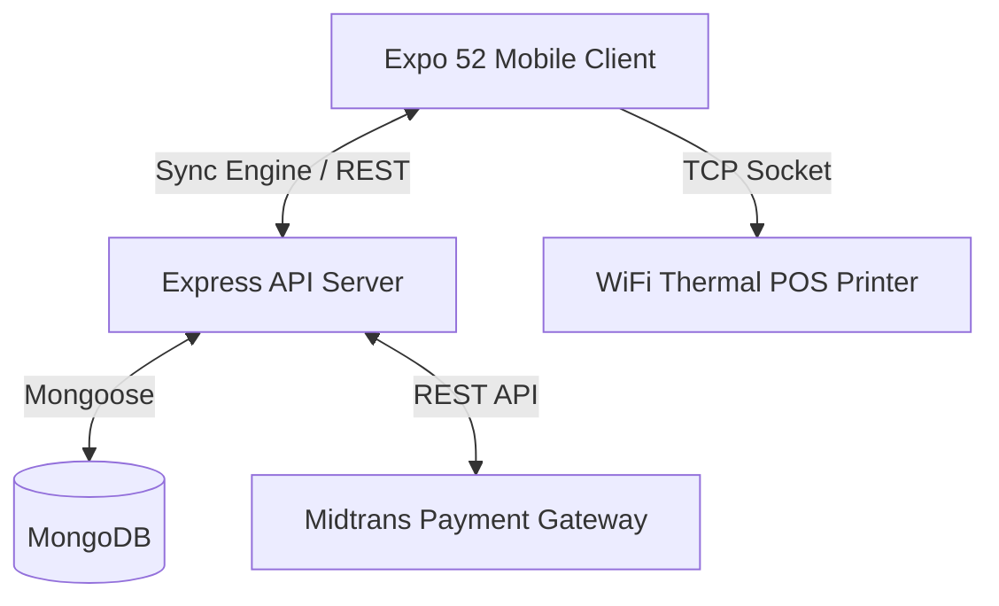
```mermaid
graph TD
    Client[Expo 52 Mobile Client] <-->|Sync Engine / REST| Server[Express API Server]
    Client -->|TCP Socket| Printer[WiFi Thermal POS Printer]
    Server <-->|Mongoose| DB[(MongoDB)]
    Server <-->|REST API| Midtrans[Midtrans Payment Gateway]
```

---

### 6. 📦 Inventory Audit System

> Physical stock auditing, barcode scanning, and recount delegation dashboard  
> 🔗 **Live Web Application:** [inventory.pethalvoid.com](https://inventory.pethalvoid.com)  
> 📊 **Scale & Impact:** Reconciles physical warehouse inventory across 100,000+ total SKU line items annually with automated discrepancy flagging.

A high-concurrency inventory reconciliation platform that automates physical count tracking, computes stock discrepancies against ERP ledgers, and manages recount delegation workflows.

**Key capabilities:**
* **Digital Scan Logging:** Operators scan barcodes and register physical counts mapped to specific shelves, racks, and warehouse branches in real-time.
* **Discrepancy Reconciliation Engine:** Automatically sums physical logs per SKU/rack and compares against ERP system values — flagging items as `MATCHED` or `DISCREPANCY`.
* **Recount Delegation Workflow:** Audit managers delegate specific discrepant items to operators for blind recounts, or apply authorized correction overrides with full audit logging.
* **Active Directory SSO:** Corporate LDAP authentication for large warehouse user management.

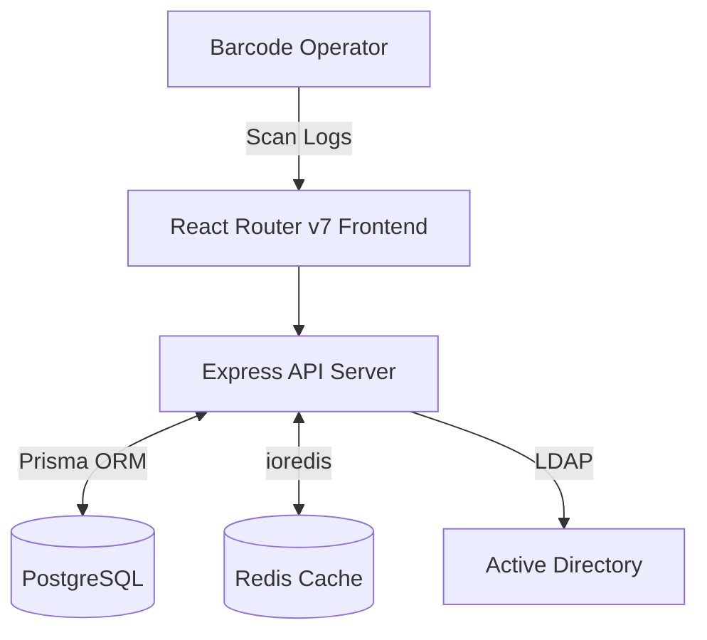
```mermaid
graph TD
    Scanner[Barcode Operator] -->|Scan Logs| App[React Router v7 Frontend]
    App --> Gateway[Express API Server]
    Gateway <-->|Prisma ORM| DB[(PostgreSQL)]
    Gateway <-->|ioredis| Redis[(Redis Cache)]
    Gateway -->|LDAP| AD[Active Directory]
```

---

### 🤝 Let's Connect

* 💼 **LinkedIn:** [linkedin.com/in/muhammad-yafizham-batubara](https://www.linkedin.com/in/muhammad-yafizham-batubara/)
* 📧 **Email:** [24434muhammad.yafizham@gmail.com](mailto:24434muhammad.yafizham@gmail.com)
* 💬 **WhatsApp:** [+62 838-5402-6650](https://wa.me/6283854026650)
* 📸 **Instagram:** [@yafizhambb](https://www.instagram.com/yafizhambb)
* 🏢 **Business:** [pethalvoid.com](https://pethalvoid.com)
