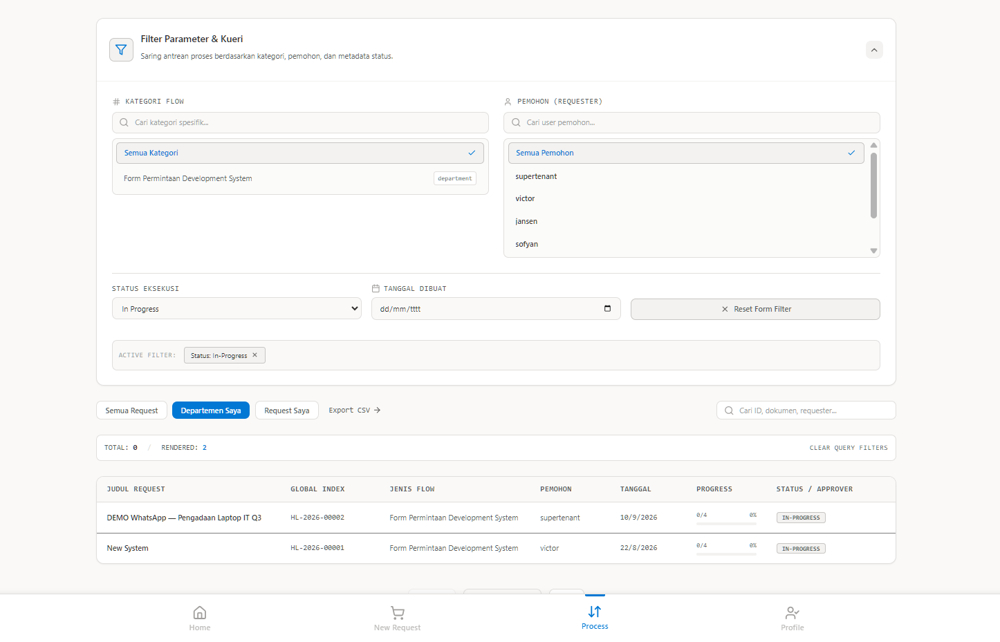
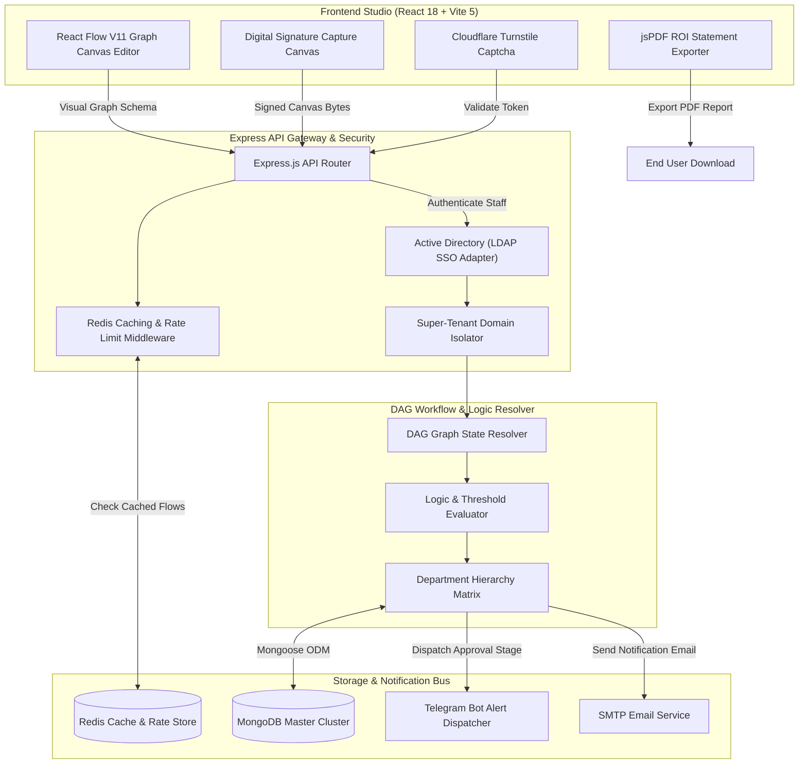
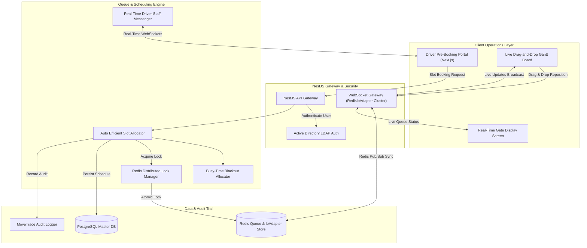
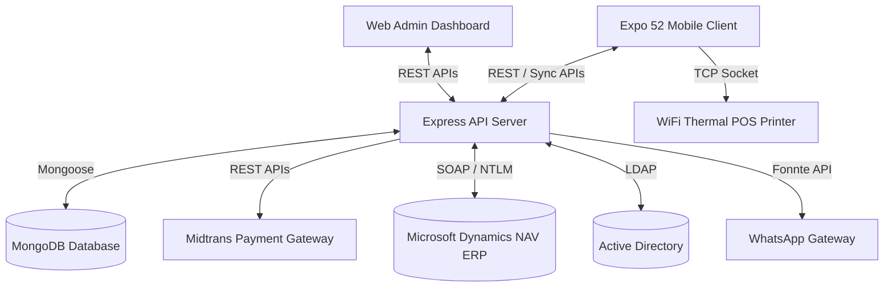
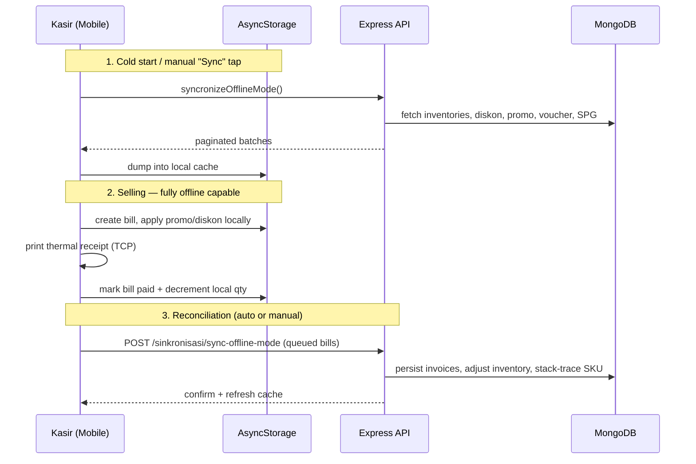
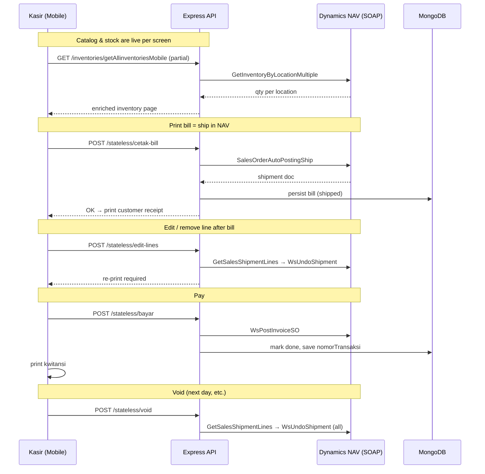
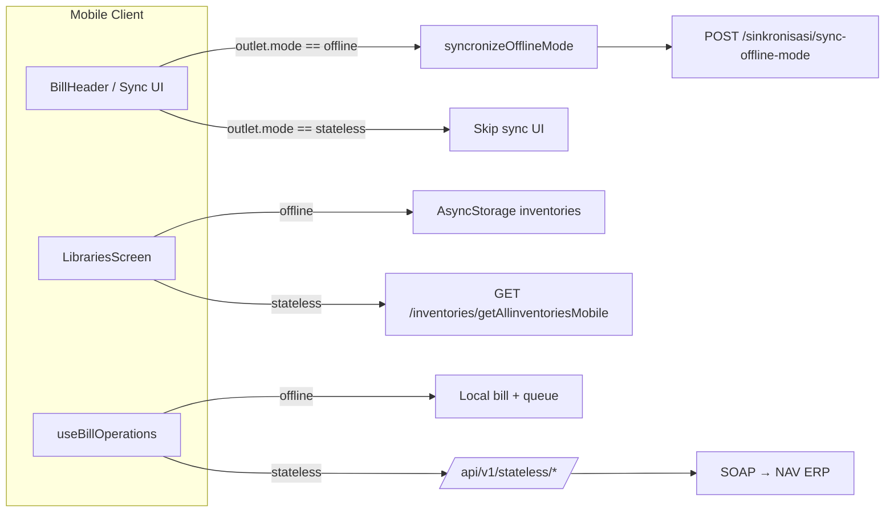
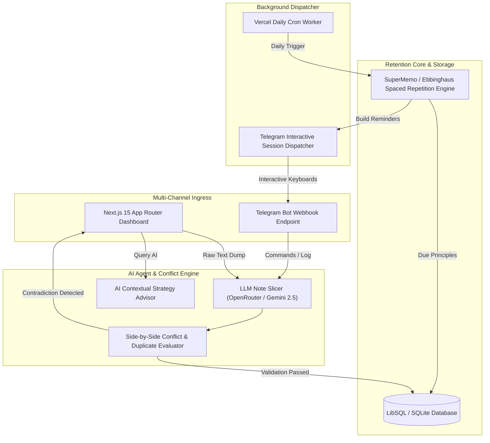
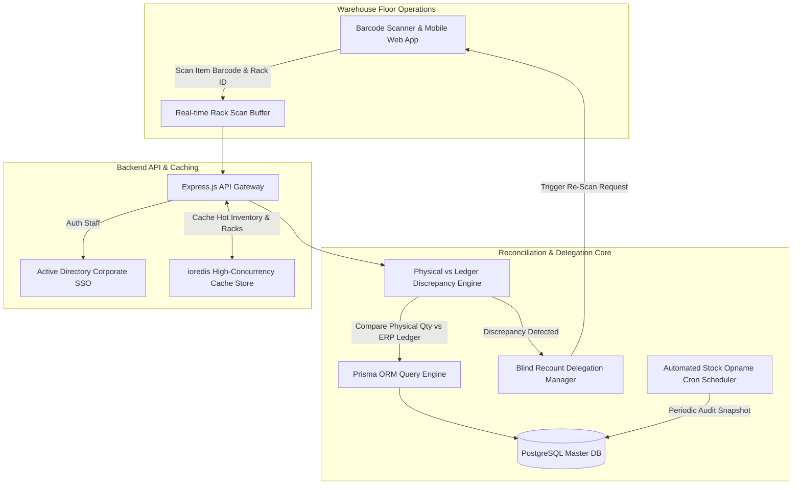
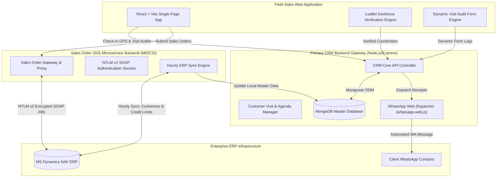

# Hi, I'm Muhammad Yafizham 👋
### Full-Stack Software Engineer | High-Concurrency Systems & Enterprise Backend

I am a Software Engineer at PT Catur Sukses Internasional specializing in high-concurrency backend architecture, real-time logistics engines, and enterprise ERP integrations. I have architected and deployed mission-critical operational platforms — including a DAG-based Approval Workflow Engine, a Redis-clustered Warehouse Queue System, and an Offline-First Mobile POS — handling distributed synchronization, concurrent transaction locking, and multi-tenant enterprise workflows at production scale. Fluent in English.

 [💼 LinkedIn](https://www.linkedin.com/in/muhammad-yafizham-batubara/)

---

### 📈 GitHub Stats

  
  

---

### 🛠️ Core Technology Stack

| Focus Area | Technologies |
| :--- | :--- |
| **AI & LLM Workflows** | OpenRouter, Gemini 2.5 Flash, OpenAI APIs, Custom Prompt Orchestration, Structured JSON Outputs, Spaced Repetition Algorithms, Telegram Bot Webhooks |
| **Backend & APIs** | NestJS, Express.js, Node.js, RESTful APIs, WebSockets (RedisIoAdapter), SOAP/NTLM |
| **Databases & Caching** | PostgreSQL, MongoDB, Redis (ioredis), SQLite/LibSQL, Prisma ORM, Mongoose |
| **Frontend & Mobile** | React 18, Next.js 15, React Native 0.76, Expo 52, React Flow, Tailwind CSS v4, Zustand |
| **Infrastructure & DevOps** | Docker, Linux VPS, Nginx, CI/CD (GitHub Actions), LDAP/Active Directory |
| **Integrations** | MS Dynamics NAV (ERP), Midtrans Payment Gateway, Cloudflare R2 / Turnstile, Telegram Bot API, WhatsApp Web API |

---

> 📂 **Source Code & Live Demos:**
> Selected production repositories are publicly available on GitHub. Full architectural specifications, system design diagrams, UI screenshot galleries, and **Live Production Web Applications** are available below for evaluation.

---

## Featured Production Projects

---

### 1. 🔄 Approval Workflow Engine (Approva.ai)

> Dynamic multi-tenant & super-tenant approval system with a visual drag-and-drop workflow designer  
> 🔗 **Live Web Application:** [approva-ai.hexadim.com](https://approva-ai.hexadim.com)  
> 📊 **Scale & Impact:** Adopted across 5+ corporate departments, automating 800+ multi-tier approval workflows monthly.

Replaces hardcoded business approval paths with a visual graph editor. Enterprise administrators visually configure conditional routing (e.g., auto-escalating based on department categories, monetary thresholds, or custom logic matrices) with digital canvas signatures, Redis caching, and automated multi-channel alert dispatches.

  

  
  

**Key capabilities:**
* **Visual Workflow Designer:** Drag-and-drop graph nodes (React Flow V11) to construct multi-tier approval chains, custom form inputs, and dynamic decision logic — no code changes, no redeployment.
* **Super-Tenant & Cross-Org Flow Duplication:** Multi-tenant architecture with super-admin controls allowing instant replication of complex workflow templates across independent organizational domains.
* **Redis High-Concurrency Caching Layer:** Custom `RedisService` middleware caching active flow instances, department hierarchies, and rate-limiting high-volume approval submissions.
* **Digital Signature & ROI PDF Exporter:** Built-in html5 canvas digital signature capture (`SignatureInput`), SHA-256 audit trails, and automated jsPDF financial ROI statement generation (`RoiStatementModal`).
* **Active Directory SSO & Cloudflare Security:** Integrates local Active Directory (LDAP) for corporate Single Sign-On and Cloudflare Turnstile Captcha to prevent automated bot submissions.

---

### 2. 🗓️ Warehouse Queue Management System (WQMS)

> Real-time loading dock booking, RedisIoAdapter WebSocket cluster, and Gantt board carrier scheduler  
> 🔗 **Live Web Application:** [orbit.pethalvoid.com](https://orbit.pethalvoid.com)  
> 📂 **Source Code:** [github.com/Ham144/warehouse-queue-management-system](https://github.com/Ham144/warehouse-queue-management-system)  
> 📊 **Scale & Impact:** Serves 12+ enterprise warehouse facilities, managing ~2,500+ monthly dock bookings with zero booking collisions.

-DC382D?style=flat-square&logo=redis)

A multi-tenant enterprise platform that optimizes warehouse loading/unloading dock schedules, manages carrier queues, and eliminates truck congestion through automated time-slot allocation.

  

| Busy Time Management | Auto Time Picker |
| :---: | :---: |
|  |  |

| Multi-Tenancy Support | Multiple Warehouse Rules |
| :---: | :---: |
|  |  |

| Driver & Duration Setup | Booking Approvals & History |
| :---: | :---: |
|  |  |

| Real-time Messenger | Organization Members |
| :---: | :---: |
|  |  |

**Key capabilities:**
* **RedisIoAdapter Cluster WebSockets:** Custom `RedisIoAdapter` service scaling NestJS Socket.io gateways across multi-node server deployments for zero-latency live board updates (`booking.gateway.ts`).
* **Busy-Time Blackout Manager:** Dynamic slot allocation engine (`busy-time.service`) auto-blocking loading docks for warehouse maintenance, shift changes, or holiday breaks.
* **Collision-Free Queue Algorithm:** Prevents double-booking using Redis distributed cache locks and automatic open-slot suggestions.
* **Integrated Driver-Staff Messenger:** Real-time persistent WebSocket chat rooms between drivers and warehouse dispatchers (`chat.gateway.ts`).
* **Active Directory SSO:** Unique LDAP configuration per tenant organization.
* **E2E Testing:** Full Playwright test suite for critical booking workflows.

---

### 3. 📱 Super POS Mobile

> Offline-first mobile Point of Sale with dual outlet modes, multi-tier promo engine, thermal printing, and payment gateway  
> 🔗 **Live Web Application:** [pos.pethalvoid.com](https://pos.pethalvoid.com)  
> 📂 **Source Code:** [github.com/Ham144/super-pos-mobile](https://github.com/Ham144/super-pos-mobile)  
> 📊 **Scale & Impact:** Deployed across 40+ retail outlets & sales reps, processing ~15,000+ monthly transactions with zero transaction loss.

[-002D62?style=flat-square)](https://midtrans.com/)

A high-performance, offline-first mobile Point of Sale application designed for sales representatives and retail outlet clerks, featuring local WiFi thermal printing, cashless payment gateway integration, and deep Microsoft Dynamics NAV ERP connectivity.

  

---

## 💼 Business Value & Real-World Impact

For mobile sales forces, field agents, or retail popups, internet connection drops shouldn't halt business. **Super POS Mobile** addresses this challenge by:
* **Offline-First Transactions**: Cashiers check out customers offline; transactions queue locally and sync automatically with the main office once a connection returns.
* **Direct Mobile Printing**: Sales reps print official invoices on-the-go to network/WiFi thermal printers directly from their phone.
* **Cashless Payments**: Accelerates checkouts using integrated Midtrans payment APIs (Indonesian Stripe) to process local electronic payments (QRIS, bank transfers, credit cards).
* **Flexible Promo Engine**: Evaluates active discount structures, item combos, and vouchers directly on the device.

---

## 🛠️ Tech Stack & Architecture

Super POS ships **three clients that talk to one Express backend**:
- **Mobile** — the field-facing POS, tuned for offline resilience and NAV-backed stock.
- **Web Admin** — catalog, promo/voucher configuration, sales reports, RBAC, and system settings.
- **Backend** — API gateway, sync engine, SOAP↔NAV bridge, payment orchestration, LDAP auth, and receipt/WhatsApp delivery.

### Mobile Client (Expo)
* **React Native (0.76) & Expo (52)**: Multi-platform mobile app development.
* **Expo Router (V4)**: Typed file-based routing.
* **NativeWind (V4)**: High-performance React Native styling based on Tailwind utility classes.
* **TCP Socket (`react-native-tcp-socket`)**: Direct network communication with thermal POS printers.
* **AsyncStorage & NetInfo**: Local offline database cache and connectivity listeners.

### Backend Server
* **Express.js (Node.js)**: API Gateway handling sync engines, promo evaluations, and transaction pipelines.
* **Mongoose (MongoDB)**: Document database for catalogs, outlet allocations, vouchers, and transactions.
* **ESC/POS & Node Thermal Printer**: Server-side layout builders for receipt generation.
* **Midtrans Client**: Payment settlement integration (Indonesian Stripe).

---

## 🚀 Key Architectural Features

### 1. Dual Outlet Modes: `offline` vs `stateless`

Every outlet is provisioned with an explicit `mode`, and the mobile app switches its entire data-flow strategy based on that flag. This lets one binary serve two very different retail realities:

| Aspect | `offline` mode | `stateless` mode |
|---|---|---|
| Intended use case | Event booths, pop-ups, unstable network locations | Permanent outlets integrated with the ERP warehouse |
| Source of truth for stock | Local `AsyncStorage` dump, reconciled on sync | **Microsoft Dynamics NAV** via SOAP (live) |
| Catalog fetch | Bulk paginated dump into `AsyncStorage` | Live partial fetch + infinite scroll per screen |
| Can sell without internet | **Yes** — transactions queue locally | **No** — cetak bill / bayar require connectivity |
| Sync engine | `syncronizeOfflineMode` → `/api/v1/sinkronisasi/sync-offline-mode` | Not used — every action hits NAV in real time |
| Bill endpoints | Local storage + sync mobile route | `/api/v1/stateless/{cetak-bill,edit-lines,bayar,void}` |
| Post-payment stock deduction | Local `updateInventoryAndStats` | Already reflected via NAV `WsPostInvoiceSO` |
| Discount below web price | Applied locally | Requires **pending approval** flow before shipment |
| Void flow | Local flag + sync | SOAP `GetSalesShipmentLines` → `WsUndoShipment` |

#### Offline mode — battle-tested sync pipeline

#### Stateless mode — always-online NAV integration

#### One codebase, two personas

The switch is driven by a single field on the outlet document — head office can migrate a booth from `offline` to `stateless` once permanent NAV connectivity is available, **no app reinstall required**.

### 2. Offline-to-Online Sync Pipeline (`syncMobile`) — offline mode only

When network connectivity returns on an outlet running in `offline` mode:
1. Mobile client tracks local sales registers and stock deductions in offline storage.
2. Once online, client initiates a sync process calling `POST /api/v1/sinkronisasi/sync-offline-mode`.
3. Backend resolves conflict checks, records transactions, and updates warehouse inventory balances.

Auto-sync respects an interval configured in `AsyncStorage.sinkronisasiInterval`, and is **skipped entirely for stateless outlets** since their state already lives on the server.

  

### 3. Network Thermal Printing
Generates ESC/POS command buffers and streams them over TCP sockets (WiFi/Ethernet) directly to configured printer IP addresses — no drivers or spoolers needed.

### 4. Dynamic API Configuration
Since field agents work across different local subnets, the app features an administrative settings modal where users can type, test, and save custom backend URL endpoints, stored securely via `AsyncStorage` and `react-native-keychain`.

### 5. Midtrans Payment Integration
Generates dynamic QRIS codes and payment links in-app, listening to webhook settlements to close open invoice bills automatically.

### 6. Enterprise Auth & Messaging (Web Admin)
* **LDAP / Active Directory** — accepts both local app accounts and AD users. First LDAP login auto-provisions a `Kasir` (or `Super Admin` for `description == "IT"`).
* **Fonnte WhatsApp Gateway** — pending receipts can be delivered directly to the customer's WhatsApp.
* **Configurable AD / SMTP / WhatsApp** — all three integrations are editable at runtime from the Application Setting menu; no redeploy needed to rotate credentials.

  
  

---

## 📸 Admin Dashboard & Operations Showcase

### 1. Promotional Rules & Vouchers

  

### 2. Purchase Orders (PO) Flow

  

### 3. Master Data & Analytics

  
  

  
  

### 4. Technical Stack Trace Reports

  

---

### 4. 🧠 Spaced Retention Bot & Cognitive AI Engine

> AI-powered cognitive manager, LLM note slicer, spaced repetition scheduler, and knowledge conflict guard  
> 📂 **Source Code:** [github.com/Ham144/principle-retention-bot](https://github.com/Ham144/principle-retention-bot)  
> 📊 **Scale & Impact:** Automates personal strategy retention, parses unstructured research notes with AI, and enforces decision consistency via automated Telegram dispatchers.

-6366F1?style=flat-square&logo=openai)

An intelligent knowledge management engine built to control cognitive capacity, eliminate decision fatigue, and enforce long-term memory retention using spaced repetition algorithms combined with LLM-powered note parsing.

**Key capabilities:**
* **LLM Note Slicing & Auto-Categorization:** Uses structured JSON mode (`response_format: { type: "json_object" }`) via OpenRouter (`google/gemini-2.5-flash`) to parse raw text dumps into core principles and auto-map them to domain threads (`pethalvoid`, `nutra`, `career-search`).
* **AI Conflict Guard:** Evaluates new rules against historical database entries in real-time. Duplicates are auto-bypassed, while contradictions trigger a side-by-side resolution panel. Low confidence scores held for manual review.
* **Spaced Repetition Engine (SuperMemo / Ebbinghaus Curve):** Computes memory decay intervals and dispatches automated reminder sessions via Telegram Webhook APIs.
* **Interactive Telegram Bot & Strategy Advisor:** Remote control via `/focus` (RAM slot management), `/load` (10-second contextual cheatsheets), `/review` (inline mastery checks), and `/tanya` (AI business strategy consultant filtering internet queries through custom principles).
* **Vercel Cron Integration:** Automated daily trigger pipeline executing spaced review dispatches with authorization header validation.

---

### 5. 📦 Inventory Audit System

> Physical stock auditing, high-concurrency ioredis caching, barcode scanning, and recount delegation dashboard  
> 📂 **Source Code:** [github.com/Ham144/inventory-audit-system](https://github.com/Ham144/inventory-audit-system)  
> 📊 **Scale & Impact:** Reconciles physical warehouse inventory across 100,000+ total SKU line items annually with automated discrepancy flagging.

-DC382D?style=flat-square&logo=redis)

A high-concurrency inventory reconciliation platform that automates physical count tracking, computes stock discrepancies against ERP ledgers, and manages recount delegation workflows.

**Key capabilities:**
* **High-Concurrency ioredis Caching:** Custom `ioredis` service caching hot SKU catalog filters, rack mappings (`office-mapping.ts`), and scan approval logs for instant barcode verification.
* **Digital Scan Logging:** Warehouse operators scan barcodes and register physical counts mapped to specific shelves, racks, and warehouse branches in real-time.
* **Discrepancy Reconciliation Engine:** Automatically sums physical logs per SKU/rack and compares against ERP system values — flagging items as `MATCHED` or `DISCREPANCY`.
* **Recount Delegation Workflow:** Audit managers delegate specific discrepant items to operators for blind recounts, or apply authorized correction overrides with full audit logging.
* **Active Directory SSO:** Corporate LDAP authentication for large warehouse user management.

---

### 6. 🗺️ Field Sales CRM (S-BIT)

> Location-verified sales routing and client order-taking CRM with dual-backend ERP microservices  
> 📊 **Scale & Impact:** Tracks 50+ active field sales reps, auditing ~3,000+ geofenced client visits monthly with direct MS Dynamics NAV ERP synchronization.

An enterprise-grade Field Sales CRM for route planning, real-time GPS visit tracking, automated WhatsApp notifications, and deep Microsoft Dynamics NAV ERP integration operating on a decoupled **Dual-Backend Microservice Architecture**.

  

**Key capabilities:**
* **Dual-Backend Microservice Architecture:** Decouples core CRM operations (visits, geofencing, agendas) from the specialized Sales Order (SO) & ERP Integration Microservice (`MIDCSI Backend`) for maximum fault tolerance and isolated scaling.
* **GPS Geofence Auditing:** Records real-time GPS coordinates during sales visits (Leaflet maps), eliminating fake check-ins.
* **Dynamics NAV ERP Sync:** Hourly NTLM v2 SOAP XML cron jobs query ERP endpoints to synchronize customer master data, credit limits, sales targets, and push field-generated Sales Orders.
* **Automated WhatsApp Dispatcher:** Sends order confirmations and visit receipts directly to customer WhatsApp contacts via `whatsapp-web.js`.
* **Dynamic Audit Forms:** Admins modify required visit questions (photo uploads, stock counts) without redeploying code.
* **Sales Analytics:** Recharts-powered dashboards for target tracking and performance reporting.

---

### 🤝 Let's Connect

* 💼 **LinkedIn:** [linkedin.com/in/muhammad-yafizham-batubara](https://www.linkedin.com/in/muhammad-yafizham-batubara/)
* 📧 **Email:** [24434muhammad.yafizham@gmail.com](mailto:24434muhammad.yafizham@gmail.com)
* 💬 **WhatsApp:** [+62 838-5402-6650](https://wa.me/6283854026650)
* 📸 **Instagram:** [@yafizhambb](https://www.instagram.com/yafizhambb)

