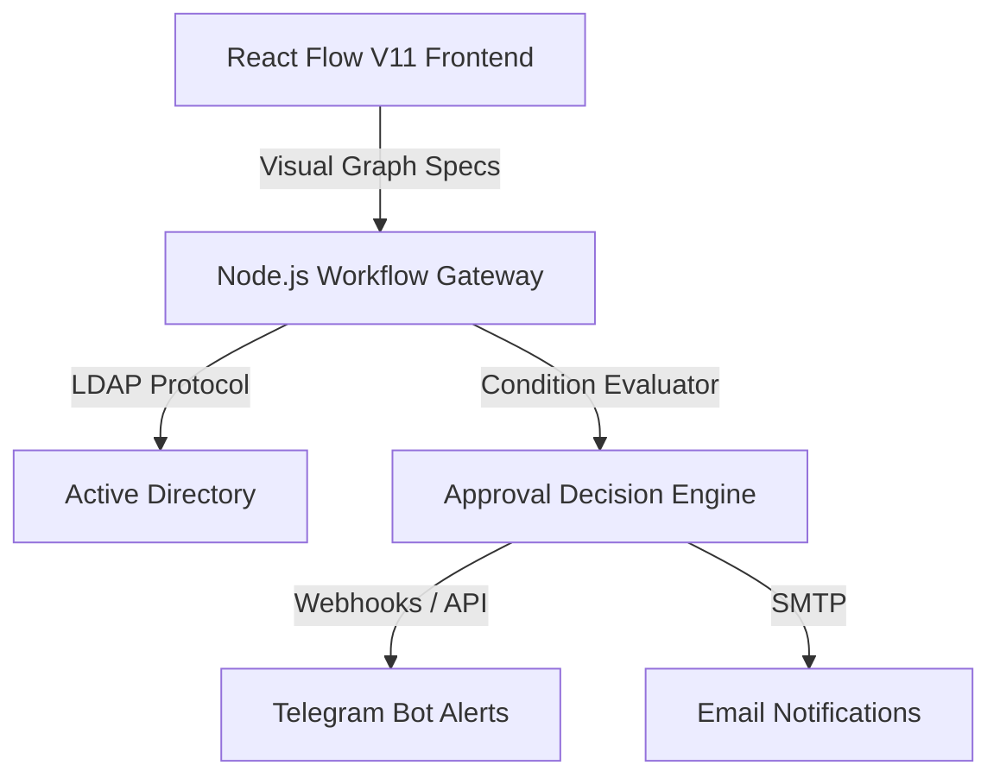
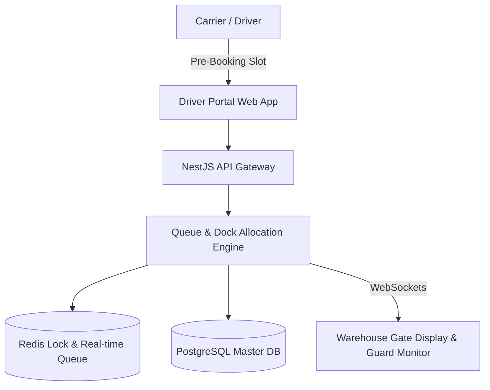
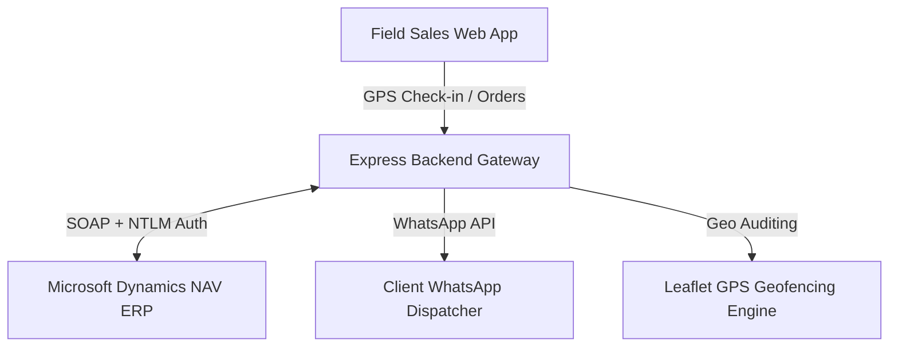
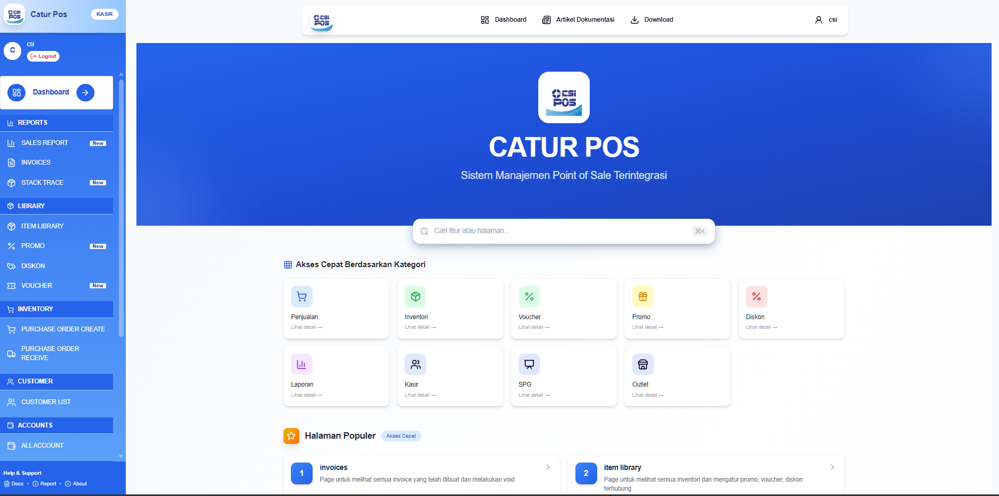
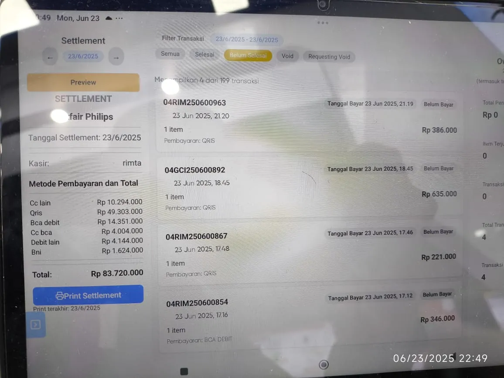
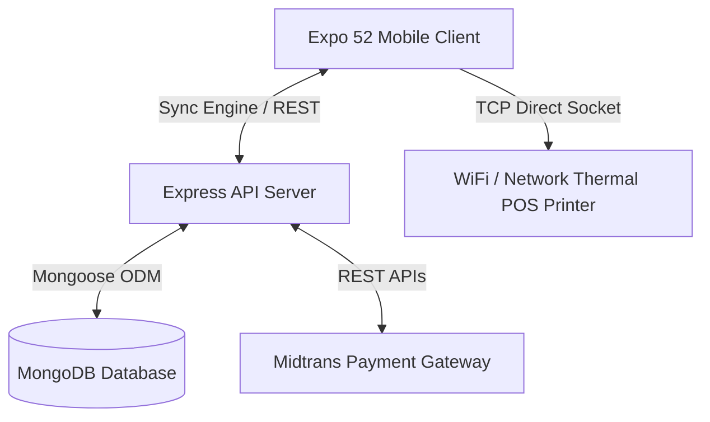
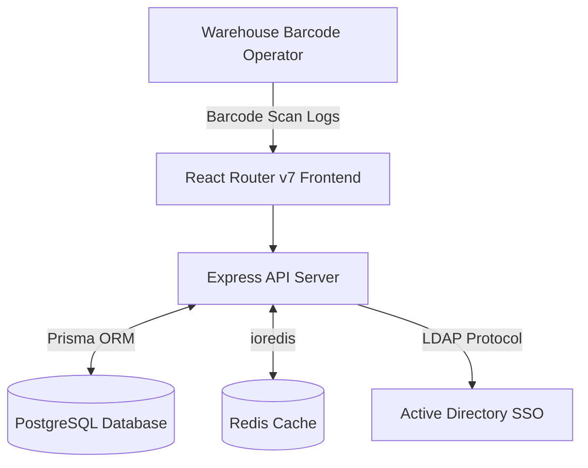
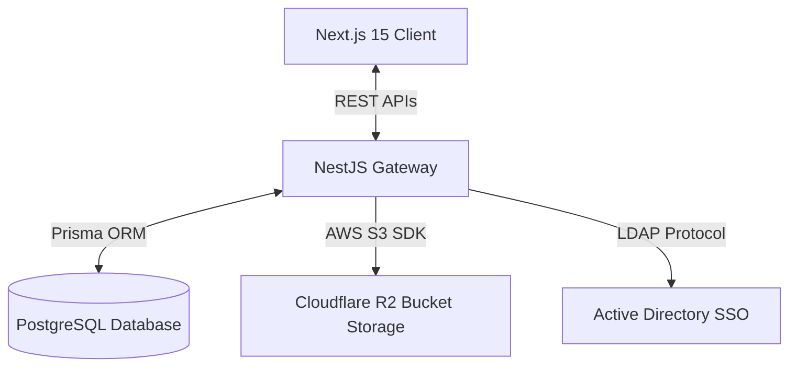

# Hi, I'm Muhammad Yafizham 👋
### AI Engineer | Backend, Agentic AI & LLM Systems Specialist

I specialize in building production AI systems, agentic workflows, RAG pipelines, and high-performance enterprise backend architectures. Fluent in English (IELTS Band 7), I have a proven track record of designing, deploying, and maintaining 14+ production business applications as a sole engineer.

[📄 Download My Resume (PDF)](https://github.com/Ham144/Ham144/raw/main/Resume_Muhammad_Yafizham_Batubara.pdf) | [💼 LinkedIn](https://www.linkedin.com/in/muhammad-yafizham-batubara/)

---

### 🛠️ Core Technology Stack

| Focus Area | Technologies |
| :--- | :--- |
| **Agentic AI & LLM Systems** | Python, LangGraph, LangChain, RAG Pipelines, Vector Databases (Pgvector, Qdrant), Langfuse Tracing, Token/Cost Monitoring |
| **Backend & Databases** | NestJS, FastAPI, Node.js, Express.js, Pydantic, PostgreSQL, MongoDB, Redis, RESTful APIs, WebSockets |
| **Frontend & Mobile** | React, Next.js, React Native, Expo, React Flow, Tailwind CSS (v3/v4), Zustand |
| **Infrastructure & DevOps** | Docker, Linux VPS, Nginx, CI/CD Pipelines (GitHub Actions), LDAP/Active Directory |

---

### 📈 GitHub Stats & Analytics

  
  

---

> 🔒 **Notice on Codebase Visibility & IP Protection:**  
> The underlying production source codes for the flagship projects below have been transitioned to **Private Repositories** to protect proprietary business logic, custom AI engines, and enterprise IP. The complete architectural specifications, system design diagrams, technical highlights, screenshot galleries, and documentation are unified below as the primary public showcase etalase. Code review access can be requested for technical evaluations.

---

## 🏛️ Master Showcase — Flagship Projects

---

### 1. 🔄 Approval Workflow Engine AI
> **Dynamic Multi-Tenant Approval System with Visual Drag-and-Drop Workflow Designer**

Replaces hardcoded business approval paths, allowing administrators to visually configure conditional routing (e.g., jump based on pricing thresholds or department categories) with digital signatures and instant notification dispatches.

#### 📸 Screenshots & UI Showcase

  

#### 💼 Business Value & Real-World Impact
* **Eliminates Hardcoded Logic:** Allows business ops to dynamically build multi-tier approval chains without redeploying code.
* **Conditional Routing:** Evaluates submitter roles, transaction values, and department rules to route approvals dynamically.
* **Corporate Integration:** Connects directly with local Active Directory (LDAP) for unified enterprise Single Sign-On (SSO).
* **Multi-Channel Alerts:** Sends real-time approval requests and updates via Telegram Bot APIs and SMTP emails.

#### 🛠️ Architecture & Core Components

---

### 2. 🗓️ Warehouse Queue Management System (WQMS)
> **Real-Time Loading Dock Booking & Gantt Board Carrier Scheduler**

A real-time, multi-tenant enterprise platform designed to optimize warehouse loading/unloading dock schedules, manage carrier queues, and eliminate truck congestion.

#### 📸 Screenshots & Operations Showcase

  

#### 💼 Business Value & Real-World Impact
* **Reduces Queue Bottlenecks:** Enables vendors and drivers to pre-book specific arrival time slots.
* **Automatic Collision Resolution:** Prevents double-booking of docks using a custom allocation algorithm backed by Redis cache locks.
* **Live Operations Visibility:** Provides warehouse guards and dock managers with a live Gantt board and real-time queue monitors.

#### 🛠️ Architecture & Tech Stack

---

### 3. 🗺️ Field Sales CRM (S-BIT)
> **Location-Verified Sales Routing & Client Order-Taking CRM**

An enterprise-grade Field Sales Customer Relationship Management platform designed for route planning, real-time GPS visit tracking, direct WhatsApp notifications, and deep ERP integration.

#### 📸 Screenshots & Field Visit Showcase

  

#### 💼 Business Value & Real-World Impact
* **Verifiable Field Visits:** Eliminates fake check-ins by auditing real-time GPS coordinates against geofenced client shop locations.
* **Direct ERP Synchronization:** Connects seamlessly with Microsoft Dynamics NAV (via SOAP/NTLM) to push sales orders, pull customer credit limits, and sync sales targets.
* **Automated WhatsApp Receipts:** Sends automated visit confirmations and order receipts to clients upon checkout via `whatsapp-web.js`.

#### 🛠️ Architecture & Dynamics NAV Sync Pipeline

---

### 4. 📱 Super POS Mobile
> **Offline-First Mobile Point of Sale (POS) App for Sales Reps & Retail Outlets**

A high-performance, offline-first mobile Point of Sale application featuring direct local network thermal receipt printing and payment gateway integration.

#### 📸 Screenshots & Mobile UI Gallery

  

| Tablet Settlement View | Invoice Register List |
| :---: | :---: |
|  |  |

| Pending Invoice Bill | Product Library Catalog |
| :---: | :---: |
|  |  |

| Promotional Rules & Vouchers | Sales Performance Analytics |
| :---: | :---: |
|  |  |

| Purchase Orders (PO) Flow | Technical Stack Trace Reports |
| :---: | :---: |
|  |  |

#### 💼 Business Value & Real-World Impact
* **Offline-First Transactions:** Cashiers checkout customers completely offline; transactions queue locally in `AsyncStorage` and auto-reconcile with central MongoDB central servers once connection returns.
* **Direct Network Printing:** Generates raw ESC/POS command buffers and streams them via TCP Sockets directly to local network/WiFi thermal printers.
* **Cashless Payments:** Integrated Midtrans payment gateway for processing QRIS and local electronic payments.

#### 🛠️ Architecture & Offline Sync Pipeline

---

### 5. 📦 Inventory Audit System (Stock Opname)
> **Physical Stock Auditing & Recount Delegation Dashboard**

A high-concurrency inventory reconciliation and stock audit platform built to automate physical count tracking, compute stock discrepancies, and sync physical warehouse assets with ERP ledgers.

#### 📸 Screenshots & Audit Dashboard

  

#### 💼 Business Value & Real-World Impact
* **Digital Scan Logging:** Operators audit warehouse inventory by scanning barcodes directly to specific shelves and racks in real-time.
* **Discrepancy Reconciliation Engine:** Automatically compares physical counts against system ERP ledgers ($\text{Physical Qty} = \sum\text{ScanLog.qty}$), categorizing items into `SESUAI` vs `SELISIH`.
* **Recount Delegation:** Audit managers can delegate specific discrepant items back to operators for blind recounts or perform direct override corrections (`finalCorrectionQty`).

#### 🛠️ Architecture & Workflow Engine

---

### 6. 💰 Petty Cash Manager (Kas Kecil)
> **Multi-Warehouse Petty Cash Journal & Monthly Budgeting System**

A secure, multi-warehouse petty cash journal and monthly budgeting platform designed for enterprise branch expense auditing, receipt storage, and Active Directory verification.

#### 📸 Screenshots & Expense Audit UI

  

#### 💼 Business Value & Real-World Impact
* **Branch Cash Isolation:** Scopes cash journals strictly to specific warehouses, ensuring cashiers only manage their designated branch accounts.
* **Budgeting Safeguards:** Limits monthly category expenses against admin-defined monthly caps (`Budget`), preventing unapproved overspending.
* **Digital Receipt Archival:** Direct uploads of expense attachments to Cloudflare R2 object storage during transaction logging, creating an immutable audit trail.

#### 🛠️ Architecture & Tech Stack

---

### 🤝 Let's Connect!

* 💼 **LinkedIn:** [linkedin.com/in/muhammad-yafizham-batubara](https://www.linkedin.com/in/muhammad-yafizham-batubara/)
* 📧 **Email:** [24434muhammad.yafizham@gmail.com](mailto:24434muhammad.yafizham@gmail.com)
* 💬 **WhatsApp:** [+62 838-5402-6650](https://wa.me/6283854026650)
* 📸 **Instagram:** [@yafizhambb](https://www.instagram.com/yafizhambb)
* 🏢 **Business:** [pethalvoid.com](https://pethalvoid.com)
